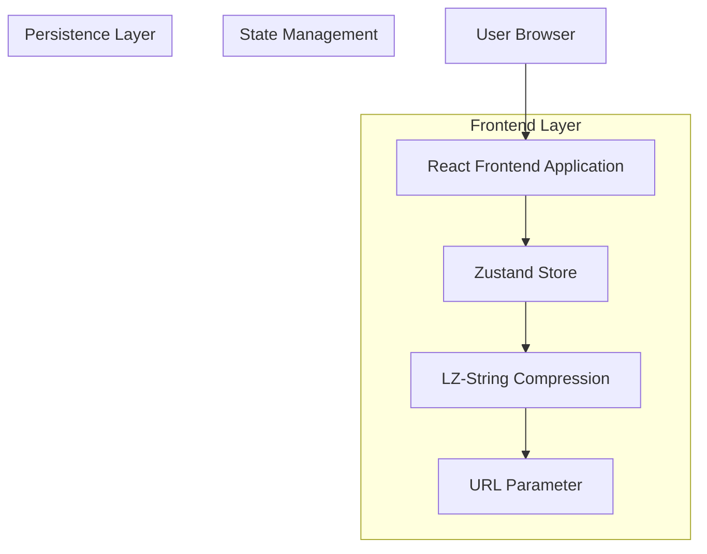
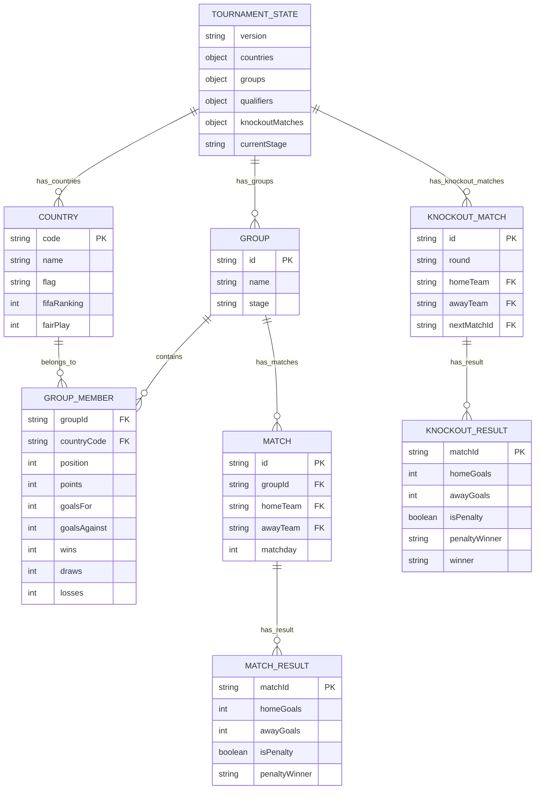

## 1. Architecture design



## 2. Technology Description

- **Frontend**: React@18 + TypeScript@5 + Vite@5
- **Initialization Tool**: vite-init
- **State Management**: Zustand@4
- **Styling**: TailwindCSS@3
- **Compression**: lz-string@1
- **Flag Icons**: flag-icons@7 o react-flag-kit
- **UI Components**: shadcn/ui o headlessui
- **Backend**: None (completamente frontend)

## 3. Route definitions

Las rutas codifican el estado progresivamente usando separadores URL-safe:

| Route | Purpose |
|-------|---------|
| / | Home page, redirige a `/qualifiers` |
| /qualifiers | Estado inicial vacío para selección de clasificados |
| /qualifiers/:code | Clasificatorios completos, código comprimido |
| /groups/:qualifierCode | Fase de grupos con clasificatorios cargados |
| /groups/:qualifierCode-:groupCode | Grupos con resultados parciales/completos |
| /knockout/:qualifierCode-:groupCode | Eliminatoria con grupos finalizados |
| /knockout/:qualifierCode-:groupCode-:knockoutCode | Eliminatoria completa con resultados |

**Formato de codificación:**
- Código = LZ-String comprimido y URL-encoded
- Separador = `-` (URL-safe para LZ-String output)
- Ejemplo: `/groups/a1b2c3d4-e5f6g7h8`

## 4. API definitions

No hay APIs backend. La comunicación es completamente cliente-side mediante:
- Zustand para estado global
- LZ-String para serialización/deserialización
- URL params para persistencia

## 5. Server architecture diagram

No aplica - aplicación completamente frontend sin servidor.

## 6. Data model

### 6.1 Data model definition



### 6.2 Data Definition Language

No hay base de datos física. Los datos se manejan mediante objetos TypeScript:

```typescript
// Tipos principales
interface Country {
  code: string;
  name: string;
  flag: string;
  fifaRanking: number;
  fairPlay: number;
}

interface Group {
  id: string;
  name: string;
  teams: string[]; // country codes
  matches: Match[];
}

interface Match {
  id: string;
  homeTeam: string;
  awayTeam: string;
  homeGoals?: number;
  awayGoals?: number;
  isPenalty?: boolean;
  penaltyWinner?: string;
}

interface TournamentState {
  version: string;
  countries: Record<string, Country>;
  groups: Record<string, Group>;
  qualifiers: {
    uefaPaths: Record<string, string>;
    intercontinentalKeys: Record<string, string>;
  };
  knockoutMatches: Record<string, KnockoutMatch>;
  currentStage: 'qualifiers' | 'groups' | 'knockout' | 'final';
}

// Datos iniciales - JSON de países
const countriesData = {
  "MEX": { "name": "México", "flag": "🇲🇽", "fifaRanking": 15, "fairPlay": 8 },
  "CAN": { "name": "Canadá", "flag": "🇨🇦", "fifaRanking": 45, "fairPlay": 9 },
  "USA": { "name": "Estados Unidos", "flag": "🇺🇸", "fifaRanking": 11, "fairPlay": 7 },
  // ... todos los países participantes
  "WAL": { "name": "Gales", "flag": "🏴󠁧󠁢󠁷󠁬󠁳󠁿", "fifaRanking": 29, "fairPlay": 6 },
  "BIH": { "name": "Bosnia y Herzegovina", "flag": "🇧🇦", "fifaRanking": 62, "fairPlay": 5 },
  "ITA": { "name": "Italia", "flag": "🇮🇹", "fifaRanking": 8, "fairPlay": 4 },
  // ... completar con todos los países de las rutas y llaves
};
```

### 6.3 Serialización Strategy

```typescript
// Compresión y descompresión del estado
import LZString from 'lz-string';

class StateSerializer {
  static serialize(state: any): string {
    const jsonString = JSON.stringify(state);
    return LZString.compressToEncodedURIComponent(jsonString);
  }
  
  static deserialize(compressed: string): any {
    const jsonString = LZString.decompressFromEncodedURIComponent(compressed);
    return JSON.parse(jsonString);
  }
  
  // Nuevo: serialización parcial por etapas
  static serializeQualifiers(qualifiers: QualifiersState): string {
    return this.serialize(qualifiers);
  }
  
  static serializeGroups(groups: GroupsState): string {
    return this.serialize(groups);
  }
  
  static serializeKnockout(knockout: KnockoutState): string {
    return this.serialize(knockout);
  }
}

// Gestión de rutas con estado incremental
class RouteStateManager {
  static buildUrl(basePath: string, ...codes: string[]): string {
    return `/${basePath}/${codes.join('-')}`;
  }
  
  static parseUrl(pathname: string): { stage: string; codes: string[] } {
    const parts = pathname.split('/').filter(Boolean);
    const stage = parts[0] || 'qualifiers';
    const codes = parts[1]?.split('-') || [];
    return { stage, codes };
  }
  
  static getStateFromUrl(url: string): TournamentState {
    const { stage, codes } = this.parseUrl(url);
    let state: TournamentState = {} as TournamentState;
    
    if (codes[0]) {
      state.qualifiers = StateSerializer.deserialize(codes[0]);
    }
    if (codes[1]) {
      state.groups = StateSerializer.deserialize(codes[1]);
    }
    if (codes[2]) {
      state.knockout = StateSerializer.deserialize(codes[2]);
    }
    
    return state;
  }
}

// Integración con React Router
const TournamentRoutes = () => {
  const { pathname } = useLocation();
  const navigate = useNavigate();
  const { qualifiers, groups, knockout } = useTournamentStore();
  
  // Auto-actualizar URL cuando cambia el estado
  useEffect(() => {
    const qualifierCode = qualifiers ? StateSerializer.serializeQualifiers(qualifiers) : '';
    const groupCode = groups ? StateSerializer.serializeGroups(groups) : '';
    const knockoutCode = knockout ? StateSerializer.serializeKnockout(knockout) : '';
    
    let newPath = '/qualifiers';
    if (qualifierCode) {
      newPath = `/qualifiers/${qualifierCode}`;
      if (groupCode) {
        newPath = `/groups/${qualifierCode}-${groupCode}`;
        if (knockoutCode) {
          newPath = `/knockout/${qualifierCode}-${groupCode}-${knockoutCode}`;
        }
      }
    }
    
    if (pathname !== newPath) {
      navigate(newPath, { replace: true });
    }
  }, [qualifiers, groups, knockout, pathname, navigate]);
};
```